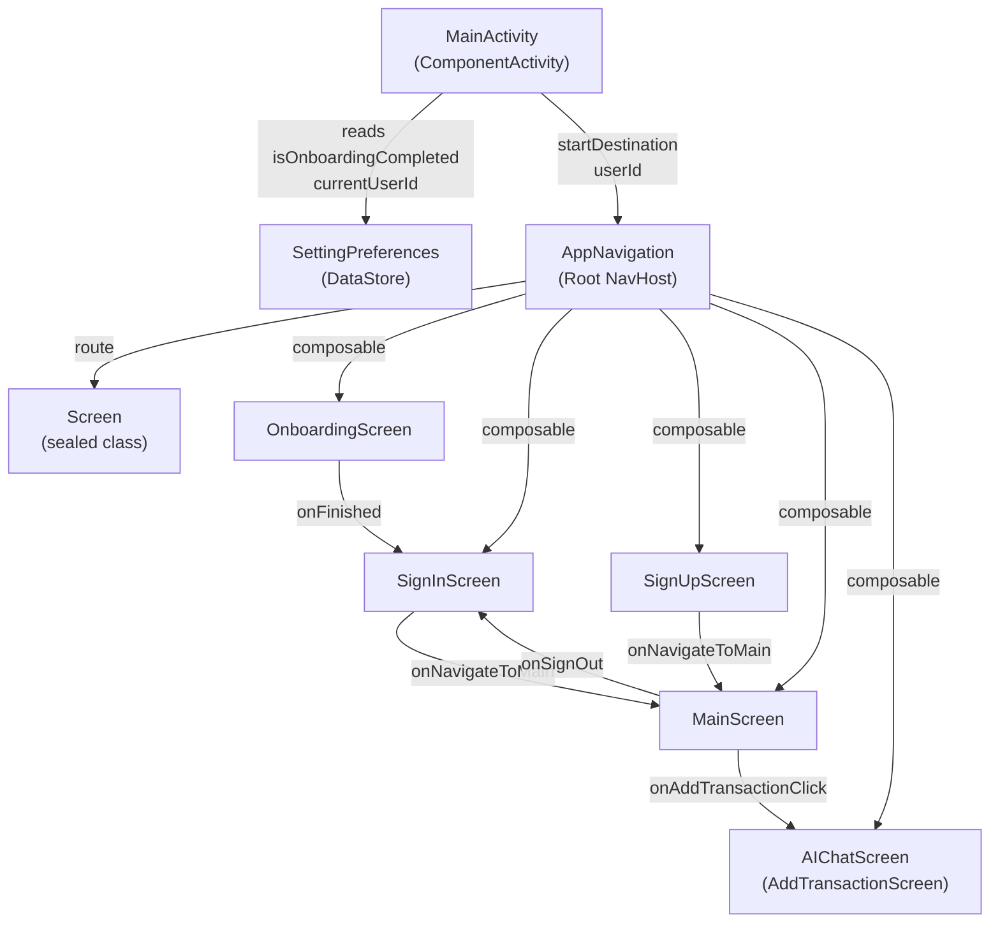
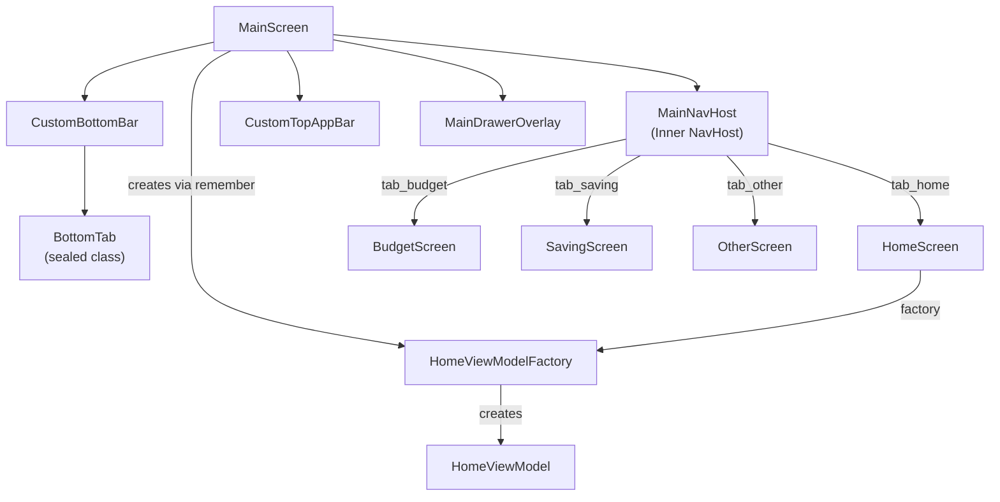
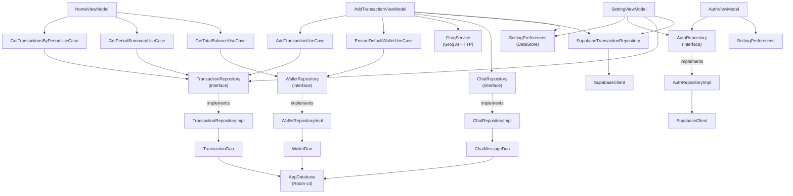
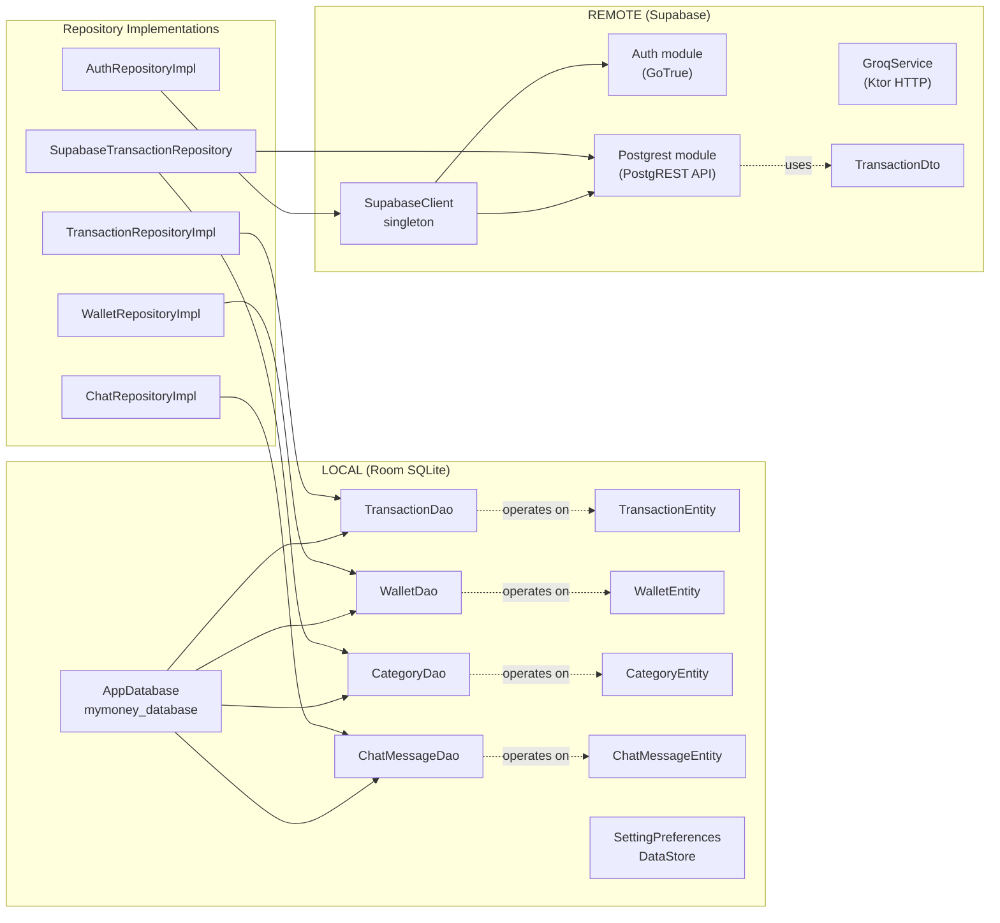
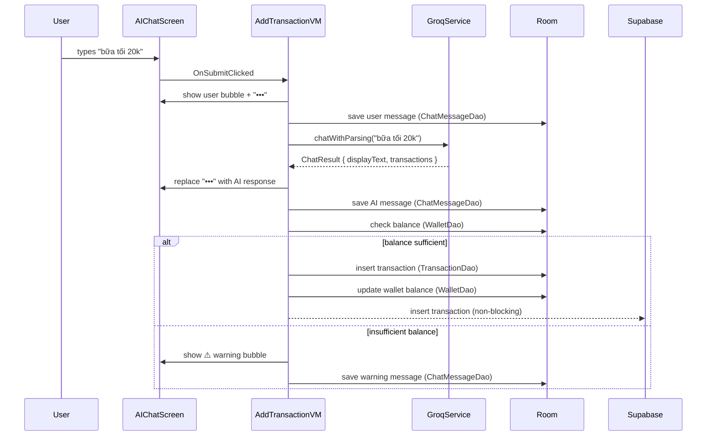
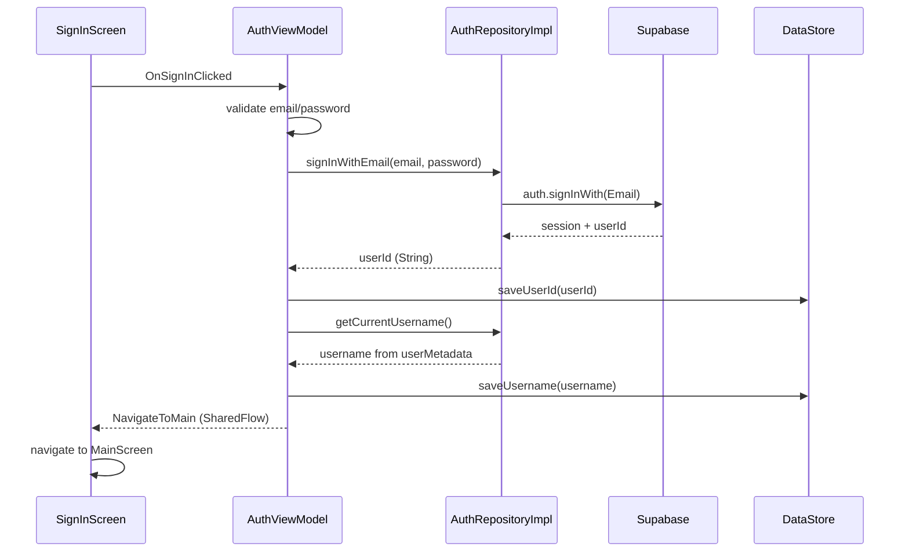

# 📐 MyMoney — Codebase Architecture Documentation

> **Generated:** 2026-05-01  
> **Stack:** Android · Kotlin · Jetpack Compose · MVVM + Clean Architecture  
> **Coverage:** 90%+ understanding of all source files and their relationships

---

## Table of Contents

1. [Architecture Overview](#1-architecture-overview)
2. [Project Structure Tree](#2-project-structure-tree)
3. [Component Graph (Mermaid.js)](#3-component-graph-mermaidjs)
4. [Core Files & Dependencies](#4-core-files--dependencies)
5. [Data Flow & Entry Points](#5-data-flow--entry-points)

---

## 1. Architecture Overview

### Pattern: MVVM + Clean Architecture (3-Layer)

MyMoney follows **Clean Architecture** with **MVVM** as the presentation pattern and **Unidirectional Data Flow (UDF)** within each screen.

```
┌─────────────────────────────────────────────────────────────┐
│                    PRESENTATION LAYER                        │
│                                                             │
│  UI (Compose Screens)  ←→  ViewModels  ←→  Contracts       │
│     ui/                    presentation/viewmodel/           │
│                                                             │
│  Pattern: UDF — Event → ViewModel → UiState → UI           │
└──────────────────────┬──────────────────────────────────────┘
                       │ interfaces only
┌──────────────────────▼──────────────────────────────────────┐
│                      DOMAIN LAYER                            │
│                                                             │
│  UseCases          Models           Repository Interfaces   │
│  domain/usecase/   domain/model/    domain/repository/      │
│                                                             │
│  Pure Kotlin — NO Android SDK, NO Room, NO Supabase         │
└──────────────────────┬──────────────────────────────────────┘
                       │ implements
┌──────────────────────▼──────────────────────────────────────┐
│                       DATA LAYER                             │
│                                                             │
│  LOCAL                      REMOTE                          │
│  ─────────────────────      ───────────────────────         │
│  Room (SQLite)              Supabase (PostgREST + Auth)     │
│  data/local/db/             data/remote/SupabaseClient.kt   │
│  data/local/entity/         data/remote/GroqService.kt      │
│  data/local/dao/            data/remote/dto/                │
│  data/local/datastore/      data/repository/*Impl.kt        │
│  data/local/static/                                         │
└─────────────────────────────────────────────────────────────┘
```

### Key Design Decisions

| Decision | Implementation |
|---|---|
| **State management** | `StateFlow<UiState>` per ViewModel |
| **Navigation** | Jetpack Navigation Compose (NavHost) |
| **Side effects** | `SharedFlow<NavEvent>` (one-shot) |
| **DI** | Manual factory pattern (`ViewModelProvider.Factory`) |
| **Async** | Kotlin Coroutines + Flow |
| **Local DB** | Room (SQLite) — offline-first |
| **Remote DB** | Supabase (PostgreSQL via PostgREST) |
| **AI** | Groq API (llama-3.3-70b-versatile) via Ktor HTTP |
| **Auth** | Supabase GoTrue (email/password) |
| **Preferences** | Jetpack DataStore (replaces SharedPreferences) |

---

## 2. Project Structure Tree

```
app/src/main/java/com/example/mymoney/
│
├── MainActivity.kt                         ← App entry point
│
├── ui/
│   ├── navigation/
│   │   ├── Screen.kt                       ← Route definitions (sealed class)
│   │   └── AppNavigation.kt                ← Root NavHost
│   │
│   ├── theme/
│   │   ├── Color.kt                        ← Material3 color tokens
│   │   ├── Theme.kt                        ← MyMoneyTheme composable
│   │   └── Type.kt                         ← Typography scale
│   │
│   ├── components/
│   │   ├── CustomBottomBar.kt              ← Bottom navigation bar (with FAB)
│   │   └── EmptyStateComposable.kt         ← Reusable empty state UI
│   │
│   ├── main/
│   │   ├── MainScreen.kt                   ← Shell: Scaffold + drawer + BottomNav
│   │   └── components/
│   │       ├── MainNavHost.kt              ← Inner NavHost for tabs
│   │       ├── CustomTopAppBar.kt          ← Top app bar
│   │       └── MainDrawerOverlay.kt        ← Side drawer (settings/sign out)
│   │
│   ├── home/
│   │   ├── HomeScreen.kt                   ← Transaction list + balance card
│   │   └── components/
│   │       ├── BalanceCard.kt              ← Total balance display
│   │       ├── TimePeriodFilter.kt         ← Day/Week/Month/Year chips
│   │       ├── TransactionItemRow.kt       ← Single transaction row
│   │       └── TransactionSummaryHeader.kt ← Income/Expense summary bar
│   │
│   ├── addtransaction/
│   │   └── AddTransactionScreen.kt         ← AI Chat screen (AIChatScreen)
│   │
│   ├── auth/
│   │   ├── SignInScreen.kt                 ← Login screen
│   │   ├── SignUpScreen.kt                 ← Register screen
│   │   └── components/
│   │       ├── AuthTextField.kt            ← Styled input field
│   │       └── SocialLoginSection.kt       ← Google/Facebook buttons
│   │
│   ├── onboarding/
│   │   ├── OnboardingScreen.kt             ← 3-page intro flow
│   │   └── components/                     ← Onboarding sub-components
│   │
│   ├── budget/
│   │   └── BudgetScreen.kt                 ← Budget tab (placeholder)
│   │
│   ├── saving/
│   │   └── SavingScreen.kt                 ← Saving tab (placeholder)
│   │
│   ├── other/
│   │   └── OtherScreen.kt                  ← Other tab (placeholder)
│   │
│   └── setting/
│       └── SettingScreen.kt                ← Settings screen
│
├── presentation/
│   └── viewmodel/
│       ├── home/
│       │   ├── HomeViewModel.kt            ← Home screen logic
│       │   ├── HomeViewModelFactory.kt     ← Manual DI factory
│       │   └── home/
│       │       ├── HomeUiState.kt          ← State data class
│       │       ├── HomeEvent.kt            ← UI events sealed class
│       │       └── TransactionItem.kt      ← UI model for list items
│       │
│       ├── addtransaction/
│       │   ├── AddTransactionViewModel.kt  ← AI chat + transaction logic
│       │   └── addtransaction/
│       │       ├── AddTransactionUiState.kt
│       │       ├── AddTransactionEvent.kt
│       │       ├── AddTransactionNavEvent.kt
│       │       ├── AddTransactionContract.kt
│       │       ├── ChatMessage.kt
│       │       └── ChatSender.kt
│       │
│       ├── auth/
│       │   ├── AuthViewModel.kt            ← Sign in / Sign up logic
│       │   └── auth/
│       │       ├── AuthUiState.kt
│       │       ├── AuthEvent.kt
│       │       ├── AuthNavEvent.kt
│       │       └── AuthContract.kt
│       │
│       ├── main/
│       │   ├── MainViewModel.kt            ← Main shell VM (minimal)
│       │   └── main/
│       │       ├── MainUiState.kt
│       │       └── MainEvent.kt
│       │
│       ├── setting/
│       │   ├── SettingViewModel.kt         ← Settings + backup logic
│       │   └── setting/
│       │       ├── SettingUiState.kt
│       │       ├── SettingEvent.kt
│       │       └── SettingNavEvent.kt
│       │
│       ├── budget/
│       │   └── BudgetViewModel.kt
│       ├── onboarding/
│       │   └── OnboardingViewModel.kt
│       ├── other/
│       │   └── OtherViewModel.kt
│       └── saving/
│           └── SavingViewModel.kt
│
├── domain/
│   ├── model/
│   │   ├── TransactionModel.kt             ← Core transaction entity
│   │   ├── WalletModel.kt                  ← Wallet entity
│   │   ├── CategoryModel.kt                ← Category entity
│   │   └── ChatMessageModel.kt             ← Chat message entity
│   │
│   ├── repository/                         ← Interfaces (pure Kotlin)
│   │   ├── TransactionRepository.kt
│   │   ├── WalletRepository.kt
│   │   ├── ChatRepository.kt
│   │   └── AuthRepository.kt
│   │
│   └── usecase/
│       ├── AddTransactionUseCase.kt        ← Validate + insert transaction
│       ├── GetTransactionsUseCase.kt       ← Get all transactions
│       ├── GetTransactionsByPeriodUseCase.kt
│       ├── GetPeriodSummaryUseCase.kt      ← Income + expense totals
│       ├── GetTotalBalanceUseCase.kt       ← Total wallet balance
│       ├── EnsureDefaultWalletUseCase.kt   ← Create wallet if missing
│       ├── MoneyFormatter.kt               ← VND number formatting
│       └── PeriodRangeUtil.kt              ← Date range calculations
│
└── data/
    ├── local/
    │   ├── db/
    │   │   └── AppDatabase.kt              ← Room DB definition (v3)
    │   ├── entity/
    │   │   ├── TransactionEntity.kt        ← Room entity: transactions
    │   │   ├── WalletEntity.kt             ← Room entity: wallets
    │   │   ├── CategoryEntity.kt           ← Room entity: categories
    │   │   └── ChatMessageEntity.kt        ← Room entity: chat_messages
    │   ├── dao/
    │   │   ├── TransactionDao.kt           ← SQL queries: transactions
    │   │   ├── WalletDao.kt                ← SQL queries: wallets
    │   │   ├── CategoryDao.kt              ← SQL queries: categories
    │   │   └── ChatMessageDao.kt           ← SQL queries: chat_messages
    │   ├── datastore/
    │   │   └── SettingPreferences.kt       ← DataStore key-value prefs
    │   └── static/
    │       └── OnboardingData.kt           ← Hardcoded onboarding slides
    │
    ├── remote/
    │   ├── SupabaseClient.kt               ← Singleton Supabase client
    │   ├── GroqService.kt                  ← Groq AI HTTP service
    │   └── dto/
    │       └── TransactionDto.kt           ← Supabase API DTO
    │
    └── repository/
        ├── TransactionRepositoryImpl.kt    ← Room impl of TransactionRepository
        ├── WalletRepositoryImpl.kt         ← Room impl of WalletRepository
        ├── ChatRepositoryImpl.kt           ← Room impl of ChatRepository
        ├── AuthRepositoryImpl.kt           ← Supabase impl of AuthRepository
        └── SupabaseTransactionRepository.kt ← Direct Supabase insert/upsert
```

---

## 3. Component Graph (Mermaid.js)

### 3.1 — App Entry & Navigation Flow



### 3.2 — MainScreen Inner Architecture



### 3.3 — ViewModel Dependency Graph



### 3.4 — Data Layer Architecture



### 3.5 — AI Chat Transaction Flow



### 3.6 — Auth Flow



---

## 4. Core Files & Dependencies

### 4.1 `MainActivity.kt`

**Purpose:** Single-Activity entry point. Reads DataStore to decide `startDestination`, renders root NavHost.

| | File | Reason |
|---|---|---|
| **Calls** | `SettingPreferences` | Read `isOnboardingCompleted`, `currentUserId` |
| **Calls** | `AppNavigation` | Root NavHost composable |
| **Calls** | `Screen` | Route string constants |
| **Calls** | `MyMoneyTheme` | Wrap entire UI in theme |
| **Called by** | *(Android OS)* | App launcher |

---

### 4.2 `AppNavigation.kt`

**Purpose:** Root `NavHost`. Maps routes to screens. Passes callbacks between screens.

| | File | Reason |
|---|---|---|
| **Calls** | `Screen` | Route strings |
| **Calls** | `OnboardingScreen` | composable(Onboarding.route) |
| **Calls** | `SignInScreen` | composable(SignIn.route) |
| **Calls** | `SignUpScreen` | composable(SignUp.route) |
| **Calls** | `MainScreen` | composable(Main.route) |
| **Calls** | `AIChatScreen` | composable(AddTransaction.route) |
| **Called by** | `MainActivity` | Rendered in setContent |

---

### 4.3 `Screen.kt`

**Purpose:** Type-safe route definitions. `Screen` = full screens. `BottomTab` = tab routes with icon/label metadata.

| | File | Reason |
|---|---|---|
| **Called by** | `AppNavigation` | Route string lookup |
| **Called by** | `MainActivity` | startDestination decision |
| **Called by** | `MainScreen`/`MainNavHost` | Tab navigation |
| **Called by** | `CustomBottomBar` | `BottomTab.all` list |

---

### 4.4 `MainScreen.kt`

**Purpose:** Shell composable. Builds `HomeViewModelFactory` manually (DI), hosts `Scaffold`, `MainNavHost`, drawer.

| | File | Reason |
|---|---|---|
| **Calls** | `AppDatabase` | `.getInstance(context)` |
| **Calls** | `TransactionRepositoryImpl` | Passes to use cases |
| **Calls** | `WalletRepositoryImpl` | Passes to use cases |
| **Calls** | `GetTransactionsByPeriodUseCase` | For HomeViewModelFactory |
| **Calls** | `GetPeriodSummaryUseCase` | For HomeViewModelFactory |
| **Calls** | `GetTotalBalanceUseCase` | For HomeViewModelFactory |
| **Calls** | `HomeViewModelFactory` | Created with `remember` |
| **Calls** | `CustomBottomBar` | Bottom nav bar |
| **Calls** | `CustomTopAppBar` | Top bar |
| **Calls** | `MainNavHost` | Tab content host |
| **Calls** | `MainDrawerOverlay` | Side drawer |
| **Calls** | `BottomTab` | Current tab detection |
| **Called by** | `AppNavigation` | Main route |

---

### 4.5 `HomeViewModel.kt`

**Purpose:** Manages `HomeUiState`. Combines 4 Room Flows (transactions, income, expense, balance) using `flatMapLatest` + `combine`. Reacts to period filter changes.

| | File | Reason |
|---|---|---|
| **Calls** | `GetTransactionsByPeriodUseCase` | Flow of transactions |
| **Calls** | `GetPeriodSummaryUseCase` | Income/expense totals |
| **Calls** | `GetTotalBalanceUseCase` | Wallet balance Flow |
| **Calls** | `PeriodRangeUtil` | Date range calculation |
| **Calls** | `MoneyFormatter` | Format amounts |
| **Called by** | `HomeViewModelFactory` | Creates instance |
| **Called by** | `HomeScreen` | `viewModel(factory)` |

**State:** `StateFlow<HomeUiState>` → emits `isLoading`, `balance`, `transactions`, `totalIncome`, `totalExpense`, `groupLabel`

---

### 4.6 `AddTransactionViewModel.kt`

**Purpose:** Core AI chat logic. Orchestrates: Groq API → parse JSON → Room insert → balance update → Supabase upload.

| | File | Reason |
|---|---|---|
| **Calls** | `GroqService` | `chatWithParsing(text)` |
| **Calls** | `AddTransactionUseCase` | Save to Room |
| **Calls** | `EnsureDefaultWalletUseCase` | Get/create default wallet |
| **Calls** | `WalletRepository` | `getTotalBalance`, `updateWalletBalance` |
| **Calls** | `ChatRepository` | Save/load chat messages |
| **Calls** | `SupabaseTransactionRepository` | Upload to cloud |
| **Calls** | `SettingPreferences` | Read `currentUserId` |
| **Calls** | `AppDatabase` | Inside factory companion |
| **Called by** | `AIChatScreen` | `viewModel(factory(...))` |

**State:** `StateFlow<AddTransactionUiState>` — messages list, input, loading, errors  
**Side effects:** `SharedFlow<AddTransactionNavEvent>`

---

### 4.7 `AuthViewModel.kt`

**Purpose:** Handles sign in / sign up / forgot password. Saves `userId` and `username` to DataStore after success.

| | File | Reason |
|---|---|---|
| **Calls** | `AuthRepository` | `signInWithEmail`, `signUpWithEmail`, `resetPassword` |
| **Calls** | `SettingPreferences` | `saveUserId`, `saveUsername` |
| **Called by** | `SignInScreen` | `viewModel(factory(ctx))` |
| **Called by** | `SignUpScreen` | `viewModel(factory(ctx))` |

**State:** `StateFlow<AuthUiState>` — email, password, isLoading, errorMessage  
**Side effects:** `SharedFlow<AuthNavEvent>` — NavigateToMain, NavigateToSignIn, NavigateToSignUp

---

### 4.8 `SettingViewModel.kt`

**Purpose:** Manages settings screen. Handles sign out, thousand separator toggle, and Room→Supabase backup.

| | File | Reason |
|---|---|---|
| **Calls** | `SettingPreferences` | Read/write prefs + userId |
| **Calls** | `AuthRepository` | `signOut()` |
| **Calls** | `TransactionRepository` | `getAllTransactions()` for backup |
| **Calls** | `SupabaseTransactionRepository` | `upsertAll()` backup |
| **Calls** | `AppDatabase` | Inside factory |
| **Called by** | `SettingScreen` | `viewModel(factory(ctx))` |

---

### 4.9 `GroqService.kt`

**Purpose:** Singleton HTTP client for Groq AI API. Sends message → receives text response + parsed `transactions` JSON block.

| | File | Reason |
|---|---|---|
| **Calls** | `BuildConfig.GROQ_API_KEY` | From `local.properties` |
| **Calls** | Ktor `HttpClient` | HTTP POST to Groq API |
| **Called by** | `AddTransactionViewModel` | `chatWithParsing(text)` |

**Returns:** `ChatResult(displayText, List<ParsedTransaction>)`  
**Endpoint:** `https://api.groq.com/openai/v1/chat/completions`  
**Model:** `llama-3.3-70b-versatile`

---

### 4.10 `SupabaseClient.kt`

**Purpose:** Singleton Supabase client. Installs `Postgrest` (DB access) and `Auth` (authentication) modules.

| | File | Reason |
|---|---|---|
| **Called by** | `AuthRepositoryImpl` | `supabase.auth.*` |
| **Called by** | `SupabaseTransactionRepository` | `supabase.postgrest[...]` |

**Config:** `SUPABASE_URL` + `SUPABASE_KEY` hardcoded (anon key, RLS-protected)

---

### 4.11 `AuthRepositoryImpl.kt`

**Purpose:** Implements `AuthRepository` using Supabase GoTrue. Handles signIn, signUp, signOut, resetPassword.

| | File | Reason |
|---|---|---|
| **Calls** | `SupabaseClient` | Supabase instance |
| **Implements** | `AuthRepository` | Domain interface |
| **Called by** | `AuthViewModel` | All auth operations |
| **Called by** | `SettingViewModel` | `signOut()` |

---

### 4.12 `SupabaseTransactionRepository.kt`

**Purpose:** Direct Supabase access layer for transactions. Handles single insert (from chat) and batch upsert (backup).

| | File | Reason |
|---|---|---|
| **Calls** | `SupabaseClient` | PostgREST queries |
| **Calls** | `CategoryDao` | Lookup `category_id` by name |
| **Called by** | `AddTransactionViewModel` | `insertTransaction()` |
| **Called by** | `SettingViewModel` | `upsertAll()` backup |

---

### 4.13 `AppDatabase.kt`

**Purpose:** Room database definition. Version 3. Contains migration scripts v1→v2 (add wallets, categories, chat_messages) and v2→v3 (add walletId to transactions).

| | File | Reason |
|---|---|---|
| **Contains** | `TransactionEntity`, `WalletEntity`, `CategoryEntity`, `ChatMessageEntity` | Entity list |
| **Exposes** | `TransactionDao`, `WalletDao`, `CategoryDao`, `ChatMessageDao` | DAO access |
| **Called by** | `MainScreen` | `AppDatabase.getInstance(context)` |
| **Called by** | `AddTransactionViewModel` | Factory companion |
| **Called by** | `SettingViewModel` | Factory companion |

**DB name:** `mymoney_database`

---

### 4.14 `SettingPreferences.kt`

**Purpose:** DataStore wrapper for app key-value preferences. Exposes typed Flows and suspend write functions.

**Keys:**

| Key | Type | Default | Description |
|---|---|---|---|
| `IS_ONBOARDING_COMPLETED` | Boolean | false | First-launch flag |
| `SUPABASE_USER_ID` | String? | null | Auth user UUID |
| `USERNAME` | String | "" | Display name (offline cache) |
| `IS_THOUSAND_SEPARATOR_ENABLED` | Boolean | true | Number format preference |

| | File | Reason |
|---|---|---|
| **Called by** | `MainActivity` | Read `isOnboardingCompleted`, `currentUserId` |
| **Called by** | `AuthViewModel` | `saveUserId`, `saveUsername` |
| **Called by** | `AddTransactionViewModel` | Read `currentUserId` |
| **Called by** | `SettingViewModel` | Read+write all prefs |

---

### 4.15 Domain Use Cases

| UseCase | Input | Output | Calls |
|---|---|---|---|
| `AddTransactionUseCase` | `TransactionModel` | Unit | `TransactionRepository.addTransaction()` |
| `GetTransactionsUseCase` | — | `Flow<List<TransactionModel>>` | `TransactionRepository.getAllTransactions()` |
| `GetTransactionsByPeriodUseCase` | from, to: Long | `Flow<List<TransactionModel>>` | `TransactionRepository.getTransactionsByPeriod()` |
| `GetPeriodSummaryUseCase` | from, to: Long | `Flow<Double>` ×2 | `TransactionRepository.getTotalIncome/Expense()` |
| `GetTotalBalanceUseCase` | userId: String | `Flow<Double>` | `WalletRepository.getTotalBalance()` |
| `EnsureDefaultWalletUseCase` | userId: String | `WalletModel` | `WalletRepository.getDefaultWallet()` + `addWallet()` |
| `MoneyFormatter` | amount: Double | String | *(pure util)* |
| `PeriodRangeUtil` | `TimePeriod` | `Range(from, to)` | *(pure util)* |

---

### 4.16 Domain Models

| Model | Fields | Maps to Entity |
|---|---|---|
| `TransactionModel` | id, note, amount, type, category, walletId, timestamp | `TransactionEntity` |
| `WalletModel` | id, userId, name, balance, icon, color, isDefault, isArchived, createdAt, updatedAt, supabaseId | `WalletEntity` |
| `CategoryModel` | id, userId, name, icon, color, type, isSystem, isArchived, sortOrder, createdAt, supabaseId | `CategoryEntity` |
| `ChatMessageModel` | id, userId, content, sender, sessionId, transactionId, timestamp | `ChatMessageEntity` |

---

## 5. Data Flow & Entry Points

### 5.1 App Startup Flow

```
Android OS
    └─► MainActivity.onCreate()
            ├─► SettingPreferences(context)
            │       └─► DataStore.data (Flow)
            │              ├─► isOnboardingCompleted (Boolean?)
            │              └─► currentUserId (String?)
            │
            └─► when {
                    null/"loading"          → wait (blank screen)
                    !isOnboardingCompleted  → Screen.Onboarding.route
                    currentUserId != null   → Screen.Main.route
                    else                    → Screen.SignIn.route
                }
                    └─► AppNavigation(startDestination, userId)
                                └─► NavHost renders appropriate screen
```

### 5.2 Home Screen Data Flow

```
HomeScreen (Composable)
    └─► HomeViewModel (created via HomeViewModelFactory)
            │
            ├─► _selectedPeriod: StateFlow<TimePeriod> (default: DAY)
            │
            └─► observeData()
                    └─► _selectedPeriod.flatMapLatest { period →
                            PeriodRangeUtil.getRangeFor(period) → Range(from, to)
                            combine(
                                GetTransactionsByPeriodUseCase(from, to)   → Flow<List>
                                    └─► TransactionRepositoryImpl
                                            └─► TransactionDao.getTransactionsByPeriod()
                                                    └─► Room SQL query
                                GetPeriodSummaryUseCase.getIncome(from, to) → Flow<Double>
                                    └─► TransactionRepositoryImpl
                                            └─► TransactionDao.getTotalIncome()
                                GetPeriodSummaryUseCase.getExpense(from, to) → Flow<Double>
                                GetTotalBalanceUseCase(userId)              → Flow<Double>
                                    └─► WalletRepositoryImpl
                                            └─► WalletDao.getTotalBalance()
                            ) → HomeUiState
                        }
                    └─► _uiState.value = HomeUiState
                            └─► HomeScreen recomposes with new data
```

### 5.3 AI Chat → Transaction Save Flow

```
AIChatScreen
    └─► AddTransactionViewModel.onEvent(OnSubmitClicked)
            └─► processUserMessage("bữa tối 20k")
                    │
                    ├─[1]─► Update UI: show user bubble + "•••" typing bubble
                    │
                    ├─[2]─► SettingPreferences.currentUserId.first() → userId
                    │
                    ├─[3]─► ChatRepository.saveMessage(userMsg) → Room
                    │
                    ├─[4]─► GroqService.chatWithParsing("bữa tối 20k")
                    │           └─► HTTP POST to api.groq.com
                    │               ├─► Request: { model, messages, max_tokens }
                    │               └─► Response: text + ```json { transactions: [...] }```
                    │
                    ├─[5]─► Replace "•••" with AI response text
                    │
                    ├─[6]─► ChatRepository.saveMessage(aiMsg) → Room
                    │
                    └─[7]─► For each parsed transaction:
                                │
                                ├─► EnsureDefaultWalletUseCase(userId)
                                │       └─► WalletRepository.getDefaultWallet()
                                │           └─► if null: WalletRepository.addWallet()
                                │
                                ├─► WalletRepository.getTotalBalance(userId).first()
                                │       └─► Check: expense > balance? → show warning
                                │
                                ├─► AddTransactionUseCase(TransactionModel)
                                │       └─► TransactionRepositoryImpl.addTransaction()
                                │               └─► TransactionDao.insertTransaction()
                                │                       └─► Room INSERT
                                │
                                ├─► WalletRepository.updateWalletBalance(walletId, newBal)
                                │       └─► WalletDao.updateBalance()
                                │               └─► Room UPDATE
                                │
                                └─► SupabaseTransactionRepository.insertTransaction() [non-blocking]
                                        └─► SupabaseClient.client.postgrest["transactions"]
                                                └─► HTTP POST to Supabase API
```

### 5.4 Sign In Flow

```
SignInScreen
    └─► AuthViewModel.onEvent(OnSignInClicked)
            ├─► Validate: email/password not blank
            └─► viewModelScope.launch {
                    _uiState → isLoading = true
                    AuthRepositoryImpl.signInWithEmail(email, password)
                        └─► SupabaseClient.client.auth.signInWith(Email)
                                └─► HTTP POST to Supabase Auth API
                    On success:
                        ├─► SettingPreferences.saveUserId(userId)
                        ├─► AuthRepositoryImpl.getCurrentUsername()
                        │       └─► supabase.auth.currentUserOrNull()?.userMetadata["username"]
                        ├─► SettingPreferences.saveUsername(username)
                        └─► _navEvent.emit(AuthNavEvent.NavigateToMain)
                                └─► SignInScreen.LaunchedEffect → navController.navigate(Main)
                    On failure:
                        └─► _uiState → errorMessage = mapAuthError(e)
                }
```

### 5.5 Backup (Room → Supabase) Flow

```
SettingScreen
    └─► SettingViewModel.onEvent(BackupConfirmed)
            └─► startBackup()
                    ├─► SettingPreferences.currentUserId.first()
                    ├─► TransactionRepositoryImpl.getAllTransactions().first()
                    │       └─► Room SELECT * FROM transactions
                    ├─► Map TransactionModel → TransactionItem DTOs
                    └─► SupabaseTransactionRepository.upsertAll(userId, dtos)
                            └─► SupabaseClient.client.postgrest["transactions"]
                                    └─► HTTP UPSERT (batch) to Supabase
```

---

## Appendix: Key Library Versions

```toml
# gradle/libs.versions.toml

# Room (Local Database)
room-runtime         = "2.x"
room-ktx             = "2.x"

# Supabase (Remote)
supabase-postgrest   = "2.x"  # io.github.jan-tennert.supabase:postgrest-kt
supabase-gotrue      = "2.x"  # io.github.jan-tennert.supabase:gotrue-kt

# Ktor (HTTP client for Groq + Supabase)
ktor-client-android  = "2.3.x"

# DataStore
datastore-preferences = "1.x"

# Navigation Compose
navigation-compose   = "2.x"

# Lifecycle / ViewModel
lifecycle-viewmodel-compose = "2.x"

# Kotlin Serialization
kotlin-serialization = "1.x"
```

---

## Appendix: UDF Pattern per Screen

Each screen follows this **Unidirectional Data Flow** contract:

```
┌─────────────────────────────────────────────────┐
│                   UI (Screen)                    │
│                                                  │
│  collectAsState(uiState) → renders UI           │
│  user action → onEvent(SomeEvent)               │
│  LaunchedEffect(navEvent) → navigate            │
└─────────┬──────────────────────┬────────────────┘
          │ Event                │ NavEvent (SharedFlow)
          ▼                      ▲
┌─────────────────────────────────────────────────┐
│                  ViewModel                       │
│                                                  │
│  _uiState: MutableStateFlow<UiState>            │
│  _navEvent: MutableSharedFlow<NavEvent>         │
│  onEvent(event) → update state / emit navEvent  │
│  init { /* subscribe to data flows */ }         │
└─────────┬──────────────────────────────────────┘
          │ calls UseCases / Repositories
          ▼
┌─────────────────────────────────────────────────┐
│             Domain (UseCases)                    │
│  operator fun invoke(...): Flow<T> / suspend    │
└─────────┬──────────────────────────────────────┘
          │ Repository interfaces
          ▼
┌─────────────────────────────────────────────────┐
│           Data Layer (Impl)                      │
│  Room DAO / Supabase client / DataStore         │
└─────────────────────────────────────────────────┘
```

---

*Documentation generated by GitHub Copilot — MyMoney Project*

